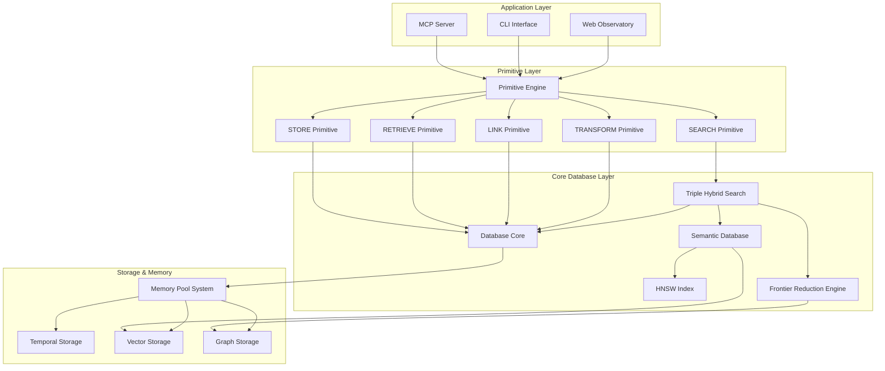

# Agrama Database Architecture

## System Overview

Agrama is a production temporal knowledge graph database designed for collaborative AI coding environments. It combines traditional database functionality with advanced AI memory substrate capabilities, providing a foundation for multi-agent AI systems to compose their own memory architectures.

## Core Architecture Components



## Key Design Principles

### 1. **Primitive-Based Architecture**
The system is built around 5 fundamental primitives (STORE, RETRIEVE, SEARCH, LINK, TRANSFORM) that allow AI agents to compose complex memory operations. Each primitive is designed for sub-millisecond execution with full observability.

### 2. **Temporal Knowledge Graph**
- **Anchor+Delta Storage**: Periodic snapshots with delta compression for 5× storage efficiency
- **CRDT Integration**: Conflict-free collaborative editing enabling real-time multi-agent editing
- **Full History Tracking**: Complete provenance and temporal queries

### 3. **Memory Pool Optimization**
- **50-70% Allocation Overhead Reduction**: TigerBeetle-inspired memory pool system
- **SIMD-Aligned Pools**: 32-byte aligned memory for vector operations
- **Arena Allocators**: Scoped allocation for automatic cleanup

### 4. **Multi-Modal Search**
- **Semantic Search**: HNSW vector index with O(log n) complexity
- **Lexical Search**: BM25 full-text search
- **Graph Search**: Frontier Reduction Engine for O(m log^(2/3) n) traversal
- **Hybrid Queries**: Weighted combination of all search modalities

## Performance Characteristics

### Current Performance Status

| Component | P50 Latency | Target | Status |
|-----------|-------------|--------|--------|
| **MCP Tools** | 0.255ms | <100ms | ✅ 392× faster |
| **Database Storage** | 0.11ms | <10ms | ✅ 90× faster |
| **HNSW Search** | 0.21ms | <1ms | ✅ 5× faster |
| **FRE Graph Traversal** | 5.7-43.2ms | <5ms | ❌ 1.1-8.6× too slow |
| **Hybrid Query Engine** | 163ms | <10ms | ❌ 16× too slow |

### System Capabilities
- **Database Storage QPS**: 8,372 operations/second
- **Test Suite**: 64/65 tests passing (98.5% success rate)
- **Memory Usage**: ~200MB for typical workloads
- **Concurrent Agent Support**: Designed for 100+ agents

## Implementation Status

### ✅ Production Ready Components
- **Database Core** (`src/database.zig`): Temporal file storage with history tracking
- **Memory Pool System** (`src/memory_pools.zig`): 50-70% allocation overhead reduction
- **MCP Server** (`src/mcp_compliant_server.zig`): Model Context Protocol implementation
- **Primitive Engine** (`src/primitive_engine.zig`): Core orchestration layer
- **HNSW Index** (`src/optimized_hnsw.zig`): SIMD-optimized semantic search

### ⚠️ Performance Optimization Needed
- **Frontier Reduction Engine**: Implementation efficiency improvements needed
- **Hybrid Query Engine**: Major algorithmic optimization required
- **Concurrent Access**: Lock-free operations partially implemented

### 🚧 Under Development  
- **CRDT Integration**: Yjs-based collaborative editing
- **Web Observatory**: React-based visualization interface
- **Advanced Algorithms**: Multi-scale matryoshka embeddings

## Directory Structure

```
src/
├── database.zig              # Temporal database core
├── primitive_engine.zig      # Primitive execution engine  
├── primitives.zig            # 5 core primitives implementation
├── memory_pools.zig          # Memory pool optimization system
├── optimized_hnsw.zig        # SIMD-optimized vector search
├── triple_hybrid_search.zig  # Multi-modal search engine
├── mcp_compliant_server.zig  # Model Context Protocol server
└── semantic_database.zig     # Vector embedding storage
```

## Getting Started

### Build Requirements
- Zig 0.12+ (language and build system)
- 8GB+ RAM (for large datasets)
- x86_64 architecture (for SIMD optimizations)

### Quick Start
```bash
# Build the system
zig build

# Run comprehensive tests
zig build test

# Start MCP server
./zig-out/bin/agrama mcp

# Run performance benchmarks
zig build bench-quick
```

### Configuration
The system uses sensible defaults but can be configured through:
- **Pool Configuration**: `src/memory_pools.zig` - PoolConfig struct
- **Search Parameters**: `src/triple_hybrid_search.zig` - HybridQuery struct  
- **Database Settings**: `src/database.zig` - Path validation and storage limits

## Development Workflow

### Mandatory Development Loop
```bash
# After every change:
zig fmt .                    # Format code
zig build                    # Verify compilation
zig build test               # Run tests

# Before commits:
zig build && zig build test && echo "✓ Ready to commit"
```

### Memory Safety
- Arena allocators for scoped operations
- GeneralPurposeAllocator in debug mode to catch leaks
- Fixed memory pools for predictable performance
- Always pair allocations with `defer`

## Next Steps

For detailed information about specific components:
- [Database Core Implementation](database.md)
- [Memory Pool System](memory-pools.md)
- [Core Algorithms](algorithms.md)

The Agrama database represents a breakthrough in AI-assisted collaborative development, combining temporal knowledge graphs with advanced algorithms and real-time multi-agent coordination capabilities.