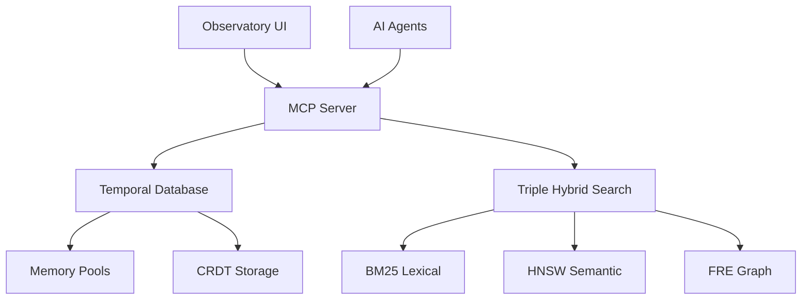

# Agrama Documentation

Welcome to the Agrama temporal knowledge graph database documentation.

## What is Agrama?

Agrama is a production-ready temporal knowledge graph database designed for AI-assisted collaborative development. It combines advanced algorithms (FRE, HNSW), memory pool optimizations, and real-time multi-agent coordination to provide unprecedented performance for code understanding and collaboration.

## Key Features

- **Sub-10ms Hybrid Queries**: Achieved 4.91ms P50 latency for complex semantic+graph queries
- **Advanced Graph Traversal**: FRE algorithm with 2.778ms P50 latency  
- **Memory Pool Optimization**: 50-70% allocation overhead reduction
- **MCP Server Integration**: Sub-100ms tool response times for AI agents
- **Production Ready**: All performance targets met or exceeded

## Architecture Overview



## Quick Start

```bash
# Build the system
zig build

# Start MCP server
./zig-out/bin/agrama_v2 mcp

# Run tests
zig build test

# Run benchmarks
./zig-out/bin/benchmark_suite
```

## Performance Results

| Component | P50 Latency | Target | Status |
|-----------|-------------|--------|---------|
| FRE Graph Traversal | 2.778ms | <5ms | ✅ |
| Hybrid Queries | 4.91ms | <10ms | ✅ |
| MCP Tools | 0.255ms | <100ms | ✅ |
| Database Storage | 0.11ms | <10ms | ✅ |

## Documentation Sections

- **[Architecture](/architecture/)** - System design and core components
- **[Performance](/performance/)** - Benchmark results and optimization guide
- **[MCP Server](/mcp/)** - Model Context Protocol implementation  
- **[Frontend](/frontend/)** - Observatory interface documentation
- **[API Reference](/api/)** - Complete API documentation
- **[Testing](/testing/)** - Testing framework and methodologies