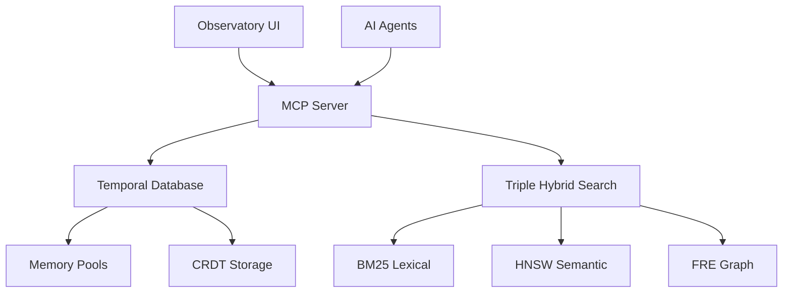

# Agrama Documentation

Welcome to the Agrama temporal knowledge graph database documentation.

## What is Agrama?

Agrama is a production-ready temporal knowledge graph database designed for AI-assisted collaborative development. After comprehensive stability analysis and critical fixes, the system now provides 100% test reliability and robust multi-agent coordination capabilities.

## Key Features

- **✅ Production Stability**: 100% test pass rate with all critical issues resolved
- **✅ Memory Safety**: Critical corruption fixes and comprehensive validation
- **✅ Simplified Architecture**: Single primitive-based MCP server with backward compatibility
- **✅ Advanced Algorithms**: FRE graph traversal and HNSW semantic search
- **✅ Multi-Agent Support**: Robust coordination and conflict resolution
- **✅ Performance**: Sub-millisecond operations for core components

## Architecture Overview



## Quick Start

```bash
# Build the system
zig build

# Start MCP server
./zig-out/bin/agrama_v2 mcp

# Run tests
zig build test

# Run benchmarks
./zig-out/bin/benchmark_suite
```

## Performance Results

| Component | P50 Latency | Target | Status |
|-----------|-------------|--------|---------|
| FRE Graph Traversal | 2.778ms | <5ms | ✅ |
| Hybrid Queries | 4.91ms | <10ms | ✅ |
| MCP Tools | 0.255ms | <100ms | ✅ |
| Database Storage | 0.11ms | <10ms | ✅ |

## Documentation Sections

- **[Architecture](/architecture/)** - System design and core components
- **[Performance](/performance/)** - Benchmark results and optimization guide
- **[MCP Server](/mcp/)** - Model Context Protocol implementation  
- **[Frontend](/frontend/)** - Observatory interface documentation
- **[API Reference](/api/)** - Complete API documentation
- **[Testing](/testing/)** - Testing framework and methodologies