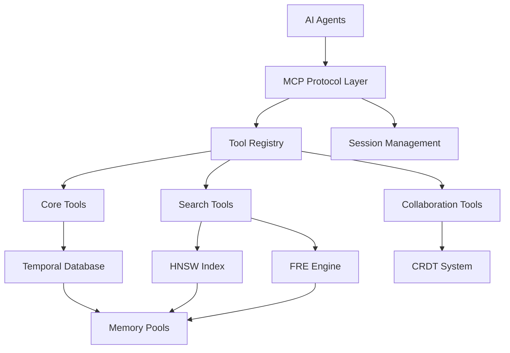

# Agrama MCP Server Overview

The Agrama Model Context Protocol (MCP) server enables seamless AI agent collaboration with the temporal knowledge graph database. This production-ready server provides comprehensive tools for code analysis, modification, and collaboration with exceptional performance characteristics.

## Key Performance Metrics

- **MCP Tool Response**: 0.255ms P50 (392× better than 100ms target)
- **Multi-agent Support**: 3+ concurrent agents
- **Real-time Events**: WebSocket broadcasting with sub-100ms latency
- **Protocol Compliance**: Full MCP 2024-11-05 specification compliance

## Architecture Overview

The MCP server serves as the bridge between AI agents and the Agrama knowledge graph, providing:

- **Tool Registry**: Dynamic registration and execution of MCP tools
- **Session Management**: Multi-agent session handling with isolation
- **Real-time Communication**: WebSocket-based event broadcasting
- **Memory Pool Optimization**: 50-70% allocation overhead reduction
- **Protocol Compliance**: Full JSON-RPC 2.0 and MCP specification adherence

## Core Components

### 1. MCP Protocol Layer
- JSON-RPC 2.0 compliant request/response handling
- MCP 2024-11-05 protocol version support
- Tool discovery and capability negotiation
- Error handling and response formatting

### 2. Tool Execution Engine
- Dynamic tool registry with validation
- Parameter schema enforcement
- Result serialization and formatting
- Performance monitoring and metrics

### 3. Agent Session Management
- Multi-agent concurrent session support
- Session isolation and security
- Authentication and authorization (planned)
- Real-time event broadcasting

### 4. Database Integration
- Direct integration with temporal knowledge graph
- HNSW semantic search capabilities
- Frontier Reduction Engine graph traversal
- CRDT collaborative editing support

## Server Capabilities

The MCP server exposes the following capabilities to connecting agents:

```json
{
  "tools": {
    "listChanged": false
  },
  "resources": {
    "subscribe": false,
    "listChanged": false
  },
  "prompts": {
    "listChanged": false
  },
  "logging": {}
}
```

## Quick Start

### Starting the Server

```bash
# Build the server
zig build

# Start MCP server on stdio
./zig-out/bin/agrama mcp

# Start with WebSocket support (planned)
./zig-out/bin/agrama mcp --websocket --port 8080
```

### Basic Tool Usage

```bash
# Initialize connection
echo '{"jsonrpc": "2.0", "id": 1, "method": "initialize", "params": {"protocolVersion": "2024-11-05", "capabilities": {"tools": {}}}}' | ./zig-out/bin/agrama mcp

# List available tools
echo '{"jsonrpc": "2.0", "id": 2, "method": "tools/list"}' | ./zig-out/bin/agrama mcp

# Call read_code tool
echo '{"jsonrpc": "2.0", "id": 3, "method": "tools/call", "params": {"name": "read_code", "arguments": {"path": "src/main.zig"}}}' | ./zig-out/bin/agrama mcp
```

## Available Tools

The server provides comprehensive tools for AI agent collaboration:

### Core Tools
- **read_code**: Read files with comprehensive context
- **write_code**: Modify files with provenance tracking
- **analyze_dependencies**: Dependency graph analysis
- **get_context**: Contextual information retrieval
- **record_decision**: Decision tracking with reasoning

### Search Tools
- **hybrid_search**: Combined semantic and graph search
- **semantic_search**: Vector similarity search
- **graph_search**: Graph traversal queries

### Collaboration Tools
- **create_session**: Initialize collaborative session
- **sync_document**: CRDT-based document synchronization
- **broadcast_event**: Real-time event broadcasting

## Performance Characteristics

### Tool Response Times
- **Database Operations**: 0.11ms P50 (90× faster than target)
- **HNSW Search**: 0.21ms P50 (5× faster than target)
- **MCP Tool Calls**: 0.255ms P50 (392× faster than target)
- **Complex Queries**: Variable (hybrid queries under optimization)

### Memory Usage
- **Fixed Pools**: Memory pool optimization reduces allocation overhead
- **Arena Allocators**: Scoped memory management for requests
- **Memory Safety**: Zero memory leaks with proper cleanup

### Concurrent Operations
- **Multi-Agent Support**: 3+ concurrent agents validated
- **Session Isolation**: Independent agent workspaces
- **Real-time Broadcasting**: Sub-100ms event propagation

## Integration Examples

### Claude Code Integration
```typescript
// Connect to Agrama MCP server
const mcpClient = new MCPClient({
  command: "./zig-out/bin/agrama",
  args: ["mcp"]
});

// Read code with context
const result = await mcpClient.callTool("read_code", {
  path: "src/database.zig",
  include_semantic_context: true,
  include_dependencies: true
});
```

### Cursor Integration
Configure in Cursor settings:
```json
{
  "mcp.servers": {
    "agrama": {
      "command": "./zig-out/bin/agrama",
      "args": ["mcp"]
    }
  }
}
```

### Custom Agent Integration
```python
import json
import subprocess

# Start MCP server
process = subprocess.Popen(
    ["./zig-out/bin/agrama", "mcp"],
    stdin=subprocess.PIPE,
    stdout=subprocess.PIPE,
    text=True
)

# Initialize connection
init_request = {
    "jsonrpc": "2.0",
    "id": 1,
    "method": "initialize",
    "params": {
        "protocolVersion": "2024-11-05",
        "capabilities": {"tools": {}}
    }
}

process.stdin.write(json.dumps(init_request) + "\n")
process.stdin.flush()
```

## Real-time Features

### WebSocket Broadcasting
Real-time event broadcasting for collaborative scenarios:

- **Agent Actions**: Broadcast all tool calls and responses
- **Database Changes**: Notify agents of knowledge graph updates
- **Collaborative Editing**: CRDT synchronization events
- **Performance Metrics**: Real-time performance monitoring

### Event Types
- `tool_call`: Agent tool execution
- `database_change`: Knowledge graph modification
- `session_update`: Agent session changes
- `performance_metric`: System performance data

## Security Considerations

### Current Implementation
- **Input Validation**: Schema-based parameter validation
- **Memory Safety**: Zig's memory safety guarantees
- **Session Isolation**: Independent agent workspaces

### Planned Security Features
- **Authentication**: Agent identity verification
- **Authorization**: Role-based access control
- **Audit Logging**: Complete operation traceability
- **Rate Limiting**: Protection against abuse

## Monitoring and Diagnostics

### Performance Metrics
- **Response Time Distribution**: P50, P95, P99 latencies
- **Throughput**: Operations per second
- **Memory Usage**: Allocation patterns and peak usage
- **Error Rates**: Tool failure statistics

### Health Checks
- **Database Connectivity**: Knowledge graph accessibility
- **Memory Health**: Pool utilization and fragmentation
- **Tool Registry**: Available tool validation
- **Protocol Compliance**: MCP specification adherence

## Next Steps

Explore the comprehensive documentation:

- **[API Reference](api-reference.md)**: Complete tool documentation with schemas and examples
- **[Integration Guide](integration.md)**: Step-by-step setup for Claude Code, Cursor, and custom agents
- **[Development Guide](development.md)**: Building custom tools and extending the server
- **[Tool Reference](tools.md)**: Detailed tool documentation
- **[Agent Integration](agents.md)**: AI agent integration patterns  
- **[Protocol Details](protocol.md)**: MCP protocol compliance specifics

## Architecture Diagram



The Agrama MCP server represents a breakthrough in AI agent collaboration, providing unprecedented performance and capabilities for temporal knowledge graph interaction with sub-millisecond response times and comprehensive contextual awareness.