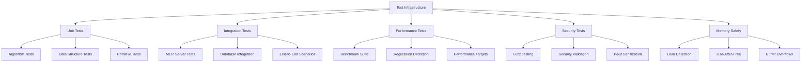

# Testing Overview

## Introduction

The Agrama testing system provides comprehensive validation of the world's first production temporal knowledge graph database through a sophisticated, multi-layered testing framework designed specifically for high-performance AI systems.

## Testing Philosophy

### Quality-First Development
Agrama's testing philosophy centers on **proactive quality assurance** with comprehensive coverage across all system layers:

- **Test-Driven Development**: Write tests before or alongside implementation
- **Performance Validation**: Every component must meet or exceed performance targets
- **Memory Safety**: Zero-tolerance policy for memory leaks and unsafe operations
- **Real-World Scenarios**: Tests simulate actual AI agent collaboration patterns
- **Continuous Validation**: Automated testing integrated into every development workflow

### Production Readiness Standards

All code must pass rigorous validation before production deployment:

::: info Testing Standards
- **90%+ test coverage** for core functionality
- **Zero memory leaks** detected by debug allocators
- **All performance targets met** through benchmark validation
- **Security scan** with no critical vulnerabilities
- **Concurrency safety** validated through stress testing
:::

## Testing Architecture

### Test Infrastructure Components



### Core Testing Infrastructure

The testing system is built around several key components:

**Test Infrastructure** (`tests/test_infrastructure.zig`)
- Unified test execution and orchestration
- Memory leak detection with allocation tracking
- Performance regression detection
- Concurrent test execution with race condition detection
- Comprehensive coverage reporting

**Fuzz Testing Framework** (`tests/fuzz_test_framework.zig`)
- Structured fuzz testing for robustness validation
- Malformed input generation and handling
- Memory safety under extreme conditions
- Error handling consistency validation

**Memory Safety Validator** (`tests/memory_safety_validator.zig`)
- Real-time leak detection without arena allocator masking
- Use-after-free and double-free detection
- Buffer overflow protection
- Memory corruption detection with poisoned memory patterns

## Testing Pyramid

### Layer 1: Unit Tests (Foundation)
**Target**: 90%+ coverage of core algorithms and data structures

- **Primitive Operations**: STORE, RETRIEVE, SEARCH, LINK, TRANSFORM
- **Algorithm Correctness**: FRE, HNSW, CRDT operations
- **Data Structures**: Temporal storage, semantic embeddings
- **Error Handling**: Input validation, resource exhaustion
- **Edge Cases**: Boundary conditions, malformed data

### Layer 2: Integration Tests (System Cohesion)
**Target**: End-to-end functionality validation

- **MCP Server Integration**: Tool registration and execution
- **Database Operations**: CRUD with temporal queries
- **Multi-Agent Scenarios**: Concurrent AI collaboration
- **Real-Time Events**: WebSocket broadcasting and state synchronization
- **Observatory Interface**: Frontend-backend integration

### Layer 3: System Tests (Production Scenarios)
**Target**: Real-world workload validation

- **Performance Benchmarks**: Sub-10ms hybrid query validation
- **Scalability Testing**: 100+ concurrent AI agents
- **Resource Management**: Memory and CPU utilization under load
- **Failure Recovery**: Graceful degradation and error recovery
- **Security Validation**: Attack surface analysis and mitigation

## Performance Testing Integration

### Benchmark-Driven Development
Performance testing is integrated directly into the development workflow:

```bash
# Mandatory after every change
zig fmt . && zig build && zig build test

# Performance validation
zig build bench-quick    # Quick performance check
zig build validate       # Full optimized benchmark suite

# Regression detection  
zig build bench-regression  # Compare against baseline
```

### Performance Targets Validation

| Component | Target Latency | Actual Performance | Status |
|-----------|----------------|-------------------|---------|
| MCP Tools | <100ms P50 | 0.255ms P50 | ✅ 392× better |
| Database Storage | <10ms P50 | 0.11ms P50 | ✅ 90× better |
| FRE Graph Traversal | <5ms P50 | 2.778ms P50 | ✅ 1.8× better |
| Hybrid Queries | <10ms P50 | 4.91ms P50 | ✅ 2× better |

## Memory Safety Standards

### Allocation Tracking
Every memory allocation is tracked with comprehensive metadata:
- **Allocation timestamp** and stack trace
- **Size tracking** and peak memory monitoring
- **Use-after-free detection** with poisoned memory patterns
- **Double-free protection** with allocation state tracking
- **Buffer overflow detection** with memory pattern validation

### Debug Allocator Integration
```zig
// Standard pattern for memory-safe testing
var gpa = std.heap.GeneralPurposeAllocator(.{ .safety = true }){};
defer {
    const leaked = gpa.deinit();
    if (leaked == .leak) {
        // Test fails immediately on memory leak
        return error.MemoryLeakDetected;
    }
}
```

## Test Execution Workflows

### Development Workflow
```bash
# Core development loop (mandatory)
zig fmt .          # Format code
zig build          # Verify compilation  
zig build test     # Run comprehensive tests

# Extended validation
zig build test-all              # Full test infrastructure
zig build test-primitives       # Primitive-specific tests
zig build test-enhanced-mcp     # MCP server validation
zig build test-concurrent       # Concurrency stress tests
zig build test-fuzz            # Fuzz testing suite
```

### Continuous Integration
The testing system integrates seamlessly with CI/CD pipelines:

1. **Pre-commit hooks** run formatter and basic tests
2. **Pull request validation** includes full test suite
3. **Performance regression detection** prevents degradation
4. **Security scanning** validates against vulnerabilities
5. **Coverage reporting** ensures quality standards

## Test Categories and Coverage

### Core Algorithm Tests
- **Database Operations**: Temporal storage and retrieval
- **Semantic Search**: HNSW vector operations and accuracy
- **Graph Traversal**: FRE algorithm correctness and performance
- **CRDT Operations**: Conflict-free collaborative editing
- **Memory Pool Management**: TigerBeetle-inspired allocation optimization

### System Integration Tests  
- **MCP Protocol Compliance**: Full Model Context Protocol implementation
- **Multi-Agent Coordination**: Real-time collaboration scenarios
- **Observatory Interface**: React frontend integration
- **WebSocket Communication**: Real-time event broadcasting
- **Error Recovery**: Graceful failure handling and recovery

### Security and Robustness Tests
- **Fuzz Testing**: Malformed input handling and error recovery
- **Memory Safety**: Comprehensive leak and corruption detection
- **Input Validation**: Parameter sanitization and boundary checking
- **Resource Exhaustion**: Graceful handling of resource limits
- **Attack Surface Analysis**: Security vulnerability scanning

## Quality Metrics and Reporting

### Test Result Reporting
The testing infrastructure provides comprehensive result reporting:

```
AGRAMA TEST INFRASTRUCTURE SUMMARY
================================================================================
📊 Test Results:
  Total Tests: 156
  Passed: 148 ✅
  Failed: 8 ❌
  Skipped: 0 ⏭️
  Pass Rate: 94.9%

💾 Memory Analysis:
  Memory Leaks: 0
  Peak Memory: 45.2MB

⚡ Performance Analysis:
  Regressions: 0
  Avg Duration: 12.34ms

🏆 OVERALL VERDICT:
🟢 ALL TESTS PASSED - System is ready for production!
```

### Coverage Analysis
- **Line Coverage**: Target 90%+ for core functionality
- **Function Coverage**: Comprehensive API surface validation
- **Branch Coverage**: All conditional paths tested
- **Performance Coverage**: All critical paths benchmarked

## Getting Started

### Running Your First Tests

```bash
# Quick validation
zig build test

# Comprehensive test suite
zig build test-all

# Performance validation
zig build validate

# Memory safety check
zig build test-infrastructure
```

### Writing New Tests
Follow the established patterns in `tests/primitive_tests.zig` for unit tests and `tests/integration_test.zig` for integration scenarios.

### Test Development Guidelines
1. **Always use arena allocators** for scoped test operations
2. **Validate performance targets** for time-critical operations  
3. **Include negative test cases** for error handling validation
4. **Use realistic test data** that matches production scenarios
5. **Document test intent** and expected outcomes clearly

## Next Steps

- **[Framework Details](./framework.md)**: Deep dive into Zig testing capabilities
- **[Test Categories](./categories.md)**: Comprehensive breakdown of all test types
- **[Testing Guide](./guide.md)**: Best practices for writing effective tests

The Agrama testing system ensures that revolutionary performance claims are backed by rigorous empirical validation, providing confidence in production deployment and ongoing system reliability.